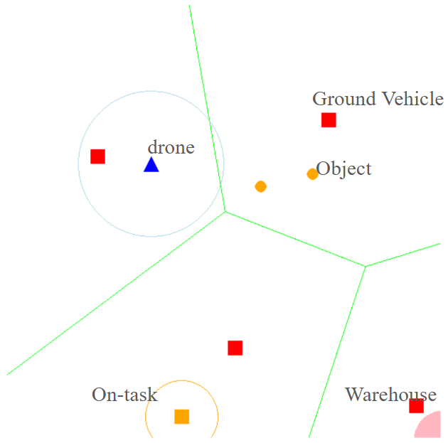
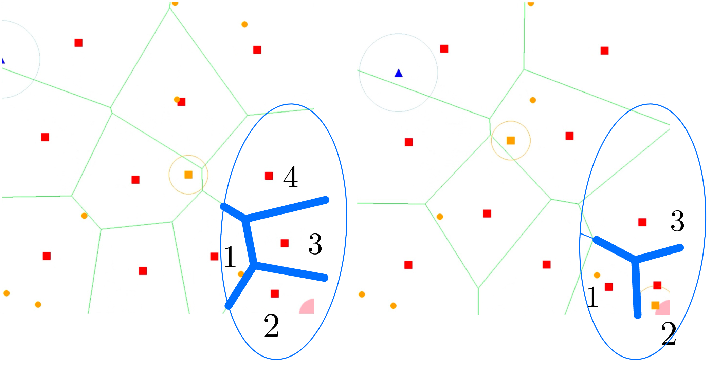
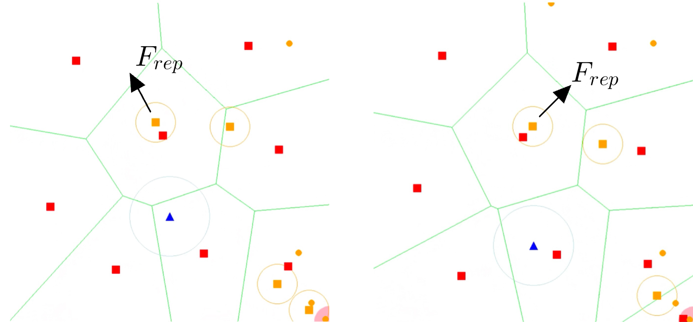
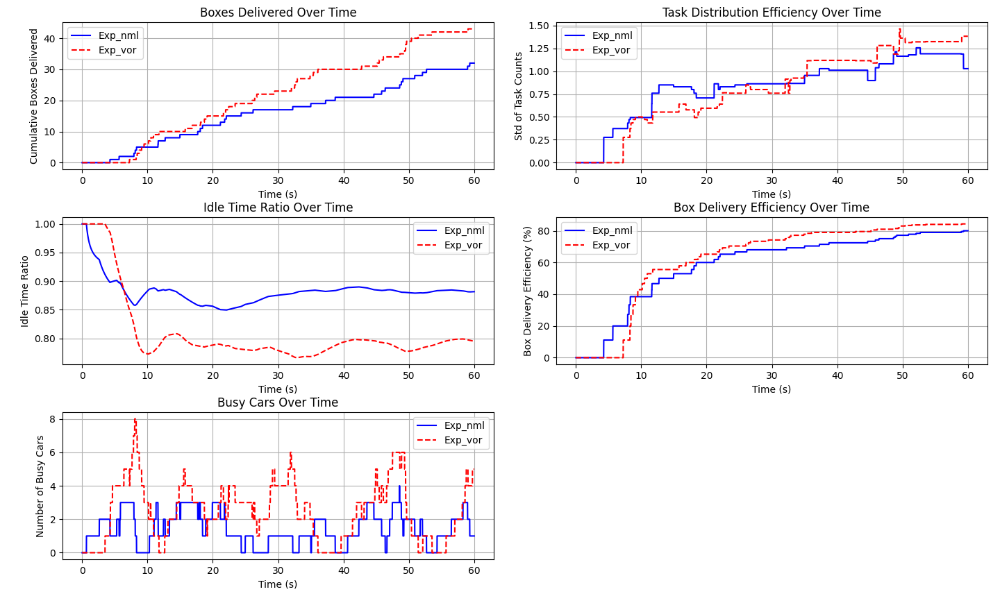

# Task Allocation by Dynamic Voronoi Partition
Task allocation is a critical component of multi-robot collaboration. Among various approaches, space partitioning methods based on Voronoi cells (VSP) offer a straightforward and effective way to assign tasks. However, traditional VSP-based task allocation methods often lack adaptability to dynamic changes in tasks and environments. To address this limitation, our model introduces a task allocation algorithm that leverages vehicle-centered Voronoi region partitioning. By dynamically adjusting the weights of Voronoi cells, this method adapts to environmental and task changes in real time. As a result, it achieves a 17% improvement in efficiency compared to conventional region-based task allocation methods.

# Model Description

To validate our method, we designed a heterogeneous multi-robot collaborative object retrieval task. The task was simplified into a 2-dimensional space, with different robots represented by simple shapes, as illustrated in the legend above. 

In our approach, each ground vehicle is treated as the centroid of a Voronoi cell. By dynamically adjusting the weight used in Voronoi cell computation, we modify the boundaries of each Voronoi cell. When a target object enters the search range of a drone, the drone communicates the object's coordinates to the ground vehicle within the corresponding Voronoi cell for task assignment. Thanks to the properties of Voronoi cells, this ensures that each object is assigned to the nearest ground vehicle.

Once a ground vehicle is assigned a task, its Voronoi cell shrinks to a small region around itself. The Voronoi cells of surrounding agents expand correspondingly to fill the newly available space. This mechanism indirectly lowers the task allocation priority of the active ground vehicle, allowing it to focus on delivering the assigned object. Meanwhile, the expanded Voronoi cells increase the likelihood of nearby agents being assigned tasks, effectively raising their task allocation priority.

The reduced Voronoi cell around the active ground vehicle is used solely for collision avoidance. Ground vehicles entering this area experience a repulsive force, ensuring that collisions are prevented.

# Results

Our method significantly enhances delivery performance across multiple metrics. The delivery rate increased by 57.14% (28 to 44 packages per minute), reflecting accelerated task execution, improved productivity, and shorter delivery cycles. Task distribution became 21.71% more balanced, reducing workload variance among vehicles, while the off-task time ratio dropped by 10.38%, meaning vehicles spent more time delivering packages. Box delivery efficiency rose by 8.79% (77.78% to 84.62%), and the average package lifecycle decreased by 26.96% (12.35 to 9.02 seconds), indicating faster turnaround times. Although the average travel distance per vehicle increased by 915.09 pixels (6082.99 to 6998.08), this aligns with heightened activity and resource utilization, as the average number of busy vehicles nearly doubled (1.18 to 2.30, a 94.92% increase). Over time, cumulative delivery data confirmed the strategy's consistent superiority, delivering 16 more packages in one minute, reducing workload variance, and sustaining higher efficiency and engagement. The proposed approach demonstrated robust responsiveness, balance, and efficiency under dynamic conditions, significantly outperforming the conventional method across all metrics.

# License
This project is licensed under the MIT License - see the LICENSE file for details.
